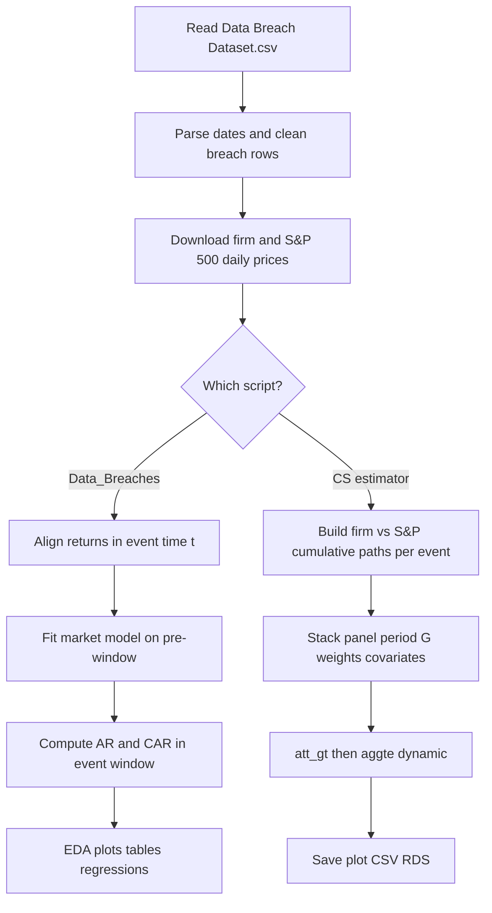

# Data Breach Disclosures and Firm Financial Outcomes

Empirical project for **Data Analysis for Policy Research using R**. It studies how **U.S. equity markets react** around **public data breach disclosures**, combining a breach-events dataset with **daily stock prices** (firms and S&P 500) from Yahoo Finance via [`tidyquant`](https://business-science.github.io/tidyquant/).

---

## What this repository contains

Two complementary analyses:

1. **Classic event study (`Data_Breaches.R` / `Data_Breaches.Rmd`)**  
   For each disclosure, estimate a **single-factor market model** (firm return on S&P return) in a **pre-event** window, then compute **abnormal returns (AR)** and **cumulative abnormal returns (CAR)** around disclosure. Includes exploratory tables, heterogeneity by breach type and size, and knit-ready HTML output from the R Markdown file.

2. **Callaway–Sant’Anna estimator (`CS estimator.R`)**  
   Builds a **panel** where each breach has a **treated** unit (firm cumulative returns) and a **synthetic never-treated control** (S&P 500 cumulative returns over the **same** trading-day window). Estimates **dynamic ATTs** with the [`did`](https://bcallaway11.github.io/did/) package (`att_gt`, `aggte`), with breach-size weights and (in the second specification) covariates.

Supporting documentation: **`EDA_DOCUMENTATION.md`** (EDA and variable definitions), **`PLOTS_EXPLANATION.md`** (figure-by-figure guide), **`CS_ESTIMATOR_DOCUMENTATION.md`** (Callaway–Sant’Anna / `CS estimator.R`), **`RESULTS_DOCUMENTATION.md`** (project findings and interpretation), **`GIT_SPEED_TIPS.md`** (optional Git workflow notes).

---

## Project logic: step-by-step flow

This section is the **end-to-end story** of the repo: what happens first, what splits, and what each branch produces.

### Overview

1. **Input:** Breach-level rows (ticker, disclosure date, breach type, size, confound flags, etc.).
2. **Enrichment:** Download **daily** stock prices for each affected ticker and for the **S&P 500** (`^GSPC`) from Yahoo Finance via **`tidyquant`**.
3. **Two analyses (same research theme, different statistics):**
   - **Event study** (`Data_Breaches.R` / `Data_Breaches.Rmd`): learn “normal” firm–market co-movement **before** disclosure, then measure **abnormal** and **cumulative abnormal returns** around disclosure.
   - **Callaway–Sant’Anna** (`CS estimator.R`): stack **firm vs index** cumulative-return paths on the **same** trading-day window around each event and estimate **dynamic treatment effects** with **`did`**.



### Steps shared by both pipelines

| Step | Action | Why |
|------|--------|-----|
| 1 | **Read** `Data Breach Dataset.csv` | Source of disclosure dates and tickers. |
| 2 | **Parse** `event_date` with `lubridate::dmy()` | Ensures dates sort and align with price data. |
| 3 | **Filter** rows (ticker/date present; breach types; confounds) | Keeps analyzable events; rules **differ slightly** between scripts (see note below). |
| 4 | **Fetch prices** for relevant tickers and `^GSPC` over calendar ranges that cover all events (plus padding) | Builds daily return series for firms and the market. |

**Sample rules differ:** `Data_Breaches.*` keeps more breach-type codes (including `HACK` and `PHYS`) and often **excludes** `confound_dum == 1` only in figures and regressions. `CS estimator.R` uses a **narrower** set of breach types and drops **confounded** events when building the breach table. Do not expect identical event counts across scripts.

---

### Path A — Event study (`Data_Breaches.Rmd` / `Data_Breaches.R`)

Executed in order inside the main loop (after S&P returns are built once):

| Step | Action | Detail |
|------|--------|--------|
| A1 | **Loop** over each breach row | One iteration = one `Event_ID`. |
| A2 | **Download** that firm’s daily prices | Window around `event_date` (with buffer); failures skip the event. |
| A3 | **Compute** daily **log** returns | Firm and S&P; merge on **calendar date**. |
| A4 | **Define event time `t`** | Trading-day index with **`t = 0`** anchored to the disclosure date (nearest trading day in the merged series). |
| A5 | **Estimation window** | Restrict to **`t ∈ [-200, -11]`** (pre-disclosure only). Require at least **60** trading days; else **skip**. |
| A6 | **Market model** | OLS: `firm_ret ~ mkt_ret` on the estimation window → intercept **α̂** and slope **β̂**. |
| A7 | **Event window** | Restrict to **`t ∈ [-5, +10]`**. |
| A8 | **Expected return** | `expected_ret = α̂ + β̂ × mkt_ret` each day in the event window. |
| A9 | **Abnormal return (AR)** | `ar = firm_ret - expected_ret`. |
| A10 | **CAR** | `car = cumsum(ar)` over the event window (cumulative from **t = −5**). |
| A11 | **CAR(0, +10)** | `car_0_10` cumulates AR only for **`t ≥ 0`**; at **`t = 10`** it equals **CAR(0, +10)** — the main outcome for rankings, bins, and regressions. |
| A12 | **Stack** all events | `bind_rows` → **`stock_panel`** (one row per event × day). |
| A13 | **Merge** breach characteristics | Types, size, `confound_dum`, etc., for plots and heterogeneity. |
| A14 | **Analyze** | Summary tables; mean AR/CAR by `t`; top “worst” paths; CAR by type/size; `lm()` on CAR(0,+10); optional knit to **HTML** from the `.Rmd`. |

**One-sentence summary:** *Before the news, estimate how the stock moves with the market; after the news, measure how returns differ from that pre-estimated relationship.*

---

### Path B — Callaway–Sant’Anna (`CS estimator.R`)

The script runs **two specifications** in one file. The **second** clears the workspace (`rm(list = ls())`), reloads data, and is the version that **writes files** to disk.

| Step | Action | Detail |
|------|--------|--------|
| B1 | **Clean breaches** | Subset of breach types; **`confound_dum == 0`** in the breach table; dedupe by `Event_ID`. |
| B2 | **Pull prices** | Firm tickers and S&P; Version 2 uses **more pre-event calendar history** for covariates. |
| B3 | **Daily simple returns** | Version 2 uses `adjusted / lag(adjusted) - 1` (see **`CS_ESTIMATOR_DOCUMENTATION.md`** for Version 1). |
| B4 | **Per event: trading window** | Calendar pad around `event_date`; **first trading day on or after** `event_date` → **`event_time = 0`**. |
| B5 | **Cumulative returns** | For the firm and for the S&P, **`cumsum`** of daily returns over the **same** aligned trading dates in the window. |
| B6 | **Two “units” per event** | **Treated:** firm path (`F_<Event_ID>`). **Control:** S&P path (`M_<Event_ID>`) entered as **never-treated** in `did`. |
| B7 | **Map to `did` inputs** | Positive **`period`**, cohort **`G`** (firm vs market); **`id_num`** identifies each stacked series. |
| B8 | **Weights** | Functions of **breach size** (log); Version 2 **normalizes** treated weights to mean 1. |
| B9 | **Covariates (Version 2)** | Pre-event volatility, momentum, and log price; events drop if covariates are missing. **`att_gt`** uses `xformla = ~ pre_mom + log_size` in the final spec. |
| B10 | **Estimate** | `did::att_gt` (doubly robust) → `aggte(..., type = "dynamic")` for the **event-time path** of effects. |
| B11 | **Output (Version 2)** | `CS_event_study.png`, `CS_event_study_estimates.csv`, `att_gt_object.rds`. |

**One-sentence summary:** *For each breach, compare the firm’s cumulative return path to the index path on the same trading days, then estimate average differences over event time with CS / `did`.*

---

### How Path A and Path B differ (same theme, not identical numbers)

| Topic | Event study (`Data_Breaches.*`) | CS estimator (`CS estimator.R`) |
|--------|----------------------------------|----------------------------------|
| **“Normal” benchmark** | α + β × market, fit **before** `t = 0` | **No** α/β; compare firm **cum** return to S&P **cum** return on same dates |
| **Returns** | **Log** daily returns | **Simple** daily returns (explicit in Version 2) |
| **Main outcome object** | AR, CAR, **CAR(0,+10)** | Panel outcome **`y`** = cumulative return from window start |
| **Inference** | Descriptive paths + **`lm()`** on CAR(0,+10) | **`did`**: group–time ATT, bootstrap, dynamic aggregation |
| **Docs** | `EDA_DOCUMENTATION.md`, `PLOTS_EXPLANATION.md` | `CS_ESTIMATOR_DOCUMENTATION.md` |

---

## Repository layout

| Path | Description |
|------|-------------|
| `Data Breach Dataset.csv` | Breach-level data (tickers, disclosure dates, breach type, size, confound flags, etc.). |
| `Data_Breaches.Rmd` | Knit to HTML: full pipeline, TOC, embedded code and figures. |
| `Data_Breaches.R` | Same analysis as a standalone R script (progress `cat` when not knitting). |
| `CS estimator.R` | Callaway–Sant’Anna / `did` pipeline; writes outputs listed below. |
| `CS_ESTIMATOR_DOCUMENTATION.md` | Methodology, panel construction, `att_gt` / `aggte`, outputs, limitations. |
| `RESULTS_DOCUMENTATION.md` | Results summary, interpretation, reporting language, reproducibility checklist. |
| `EDA_DOCUMENTATION.md` | EDA objectives, cleaning steps, variable glossary, limitations. |
| `PLOTS_EXPLANATION.md` | Plain-language descriptions of plots from the event-study analysis. |
| `Plots/` | PNG figures (may be regenerated by your runs). |
| `.gitignore` | Ignores `.RData`, `.Rhistory`, knitted `*.html` / `*.pdf`, IDE junk. |

---

## Data source

Breach records are based on **Rosati & Lynn (2020)**, **[Mendeley Data](https://data.mendeley.com/)**, DOI **10.17632/w33nhh3282.1** (NYSE/NASDAQ firms; disclosure dates and breach characteristics).  

Market data: **Yahoo Finance** via `tidyquant` (not bundled in this repo beyond what you download when scripts run).

---

## Requirements

- **R** (recent version recommended; code uses tidyverse-style pipelines).
- **R packages**

  **Event-study analysis**

  - `tidyverse`, `tidyquant`, `lubridate`, `ggplot2`, `knitr` (for knitting `Data_Breaches.Rmd`)

  **CS estimator script**

  - `tidyverse`, `tidyquant`, `lubridate`, [`did`](https://cran.r-project.org/package=did)

Install missing packages in R, for example:

```r
install.packages(c("tidyverse", "tidyquant", "lubridate", "ggplot2", "knitr", "did"))
```

**Network access** is required to download stock/index prices the first time you run the scripts.

---

## How to run

### 1. Working directory and paths

Scripts expect the **project folder** to be the working directory so that `"Data Breach Dataset.csv"` resolves.

- **`Data_Breaches.Rmd`** and **`Data_Breaches.R`** currently use an absolute `setwd(...)` pointing at a local Desktop path. **Edit that line** to your clone location, or remove `setwd` and open the project in RStudio / run with the session’s working directory already set to this folder.

### 2. Event-study report (recommended for a formatted write-up)

In RStudio: open `Data_Breaches.Rmd` → **Knit** to HTML (or use `rmarkdown::render("Data_Breaches.Rmd")` from this directory).

The main loop fetches prices per event and uses `Sys.sleep(0.3)` to throttle requests; the first full knit can take a while.

### 3. Standalone R script

From R, with working directory set to this folder:

```r
source("Data_Breaches.R")
```

### 4. Callaway–Sant’Anna analysis

```r
source("CS estimator.R")
```

The file runs **two** specifications in sequence; the second block starts with `rm(list = ls())` and overwrites objects from the first.

**Generated files** (created in the working directory when the second specification completes):

- `CS_event_study.png` — dynamic ATT plot  
- `CS_event_study_estimates.csv` — point estimates and SEs for the plotted series  
- `att_gt_object.rds` — saved `att_gt` fit for later inspection  

---

## Methods summary

The **ordered steps**, **branching**, and **comparison table** are in **[Project logic: step-by-step flow](#project-logic-step-by-step-flow)** above. This subsection is a compact formula reference.

### Event study (`Data_Breaches.*`)

- **Event time `t`:** Trading days relative to disclosure (`t = 0` ≈ disclosure day on the trading calendar).  
- **Estimation window:** \(t \in [-200, -11]\) — fit \(\text{firm\_ret} \sim \text{mkt\_ret}\); require at least **60** trading days.  
- **Event window:** \(t \in [-5, +10]\); **AR** = actual return minus fitted expected return; **CAR** = cumulative AR.  
- **`car_0_10`** cumulates AR only for \(t \geq 0\); at **`t = 10`** this equals **CAR(0, +10)** used in rankings and regressions.  
- **`confound_dum == 1`:** Another major announcement within ~10 days; excluded from main plots/regressions but retained in the breach table.

See **`EDA_DOCUMENTATION.md`** for variable-level detail and **`PLOTS_EXPLANATION.md`** for how to read each figure.

### CS estimator (`CS estimator.R`)

Full formulas, `period` / `G` coding (Version 1 vs 2), covariates, weights, and outputs: **`CS_ESTIMATOR_DOCUMENTATION.md`**. In short: **`did::att_gt`** with `control_group = "nevertreated"`, `panel = FALSE`, doubly robust estimation, bootstrap inference; the saved plot and CSV come from the **second** specification in the script.

---

## Why use the CS estimator?

We include the CS estimator as a **complement** to the classic event study, not a replacement.

- **Second benchmark for \"normal\" performance:** The event study uses a pre-event market model (`alpha + beta * market return`). The CS script instead compares **firm cumulative return paths** to **S&P cumulative paths** on the same trading days around disclosure.
- **Dynamic effect path with formal inference:** `att_gt` + `aggte(type = "dynamic")` gives an event-time effect curve with bootstrap-based uncertainty, rather than relying only on average AR/CAR plots.
- **Doubly robust specification and covariates:** Version 2 adds covariates (for example pre-event momentum and log size) in a DR framework to reduce sensitivity to simple unadjusted comparisons.
- **Policy-relevant weighting:** Breach-size-based weights let larger incidents matter more while normalization in Version 2 prevents a few mega-events from dominating.
- **Robustness check across methods:** If conclusions are similar in both pipelines (classic event study and CS), confidence in the substantive finding is stronger.

In short, the CS branch helps answer the same research question with a **different identification lens** and stronger event-time inference.

---

## Limitations (high level)

- Many tickers fail price download or lack enough pre-event history → **sample size for stock panel < full breach count** (skipped events are tabulated in the Rmd).  
- **Disclosure date** is used, not necessarily the date the breach occurred.  
- Single-factor market model and Yahoo data are standard but imperfect; CS spec uses a different comparison (index path vs firm path).  
- Causal interpretation requires the usual event-study / DID caveats; see **`EDA_DOCUMENTATION.md`** Section 10.

---

## License and citation

If you reuse this code or the breach dataset, cite **Rosati & Lynn (2020)** and the **Mendeley Data** DOI above. Add your own license if you distribute the repository; this README does not specify a software license.

---

## Related reading in this repo

| Document | Contents |
|----------|----------|
| `EDA_DOCUMENTATION.md` | Sample sizes, cleaning, EDA findings, limitations |
| `PLOTS_EXPLANATION.md` | Appendix and main plots explained in plain language |
| `CS_ESTIMATOR_DOCUMENTATION.md` | CS / `did` panel, two specs, outputs, comparison to event study |
| `RESULTS_DOCUMENTATION.md` | Results narrative, what is established, and what to rerun for exact numbers |
| `GIT_SPEED_TIPS.md` | Why pushes may feel slow and how to shrink commits |
